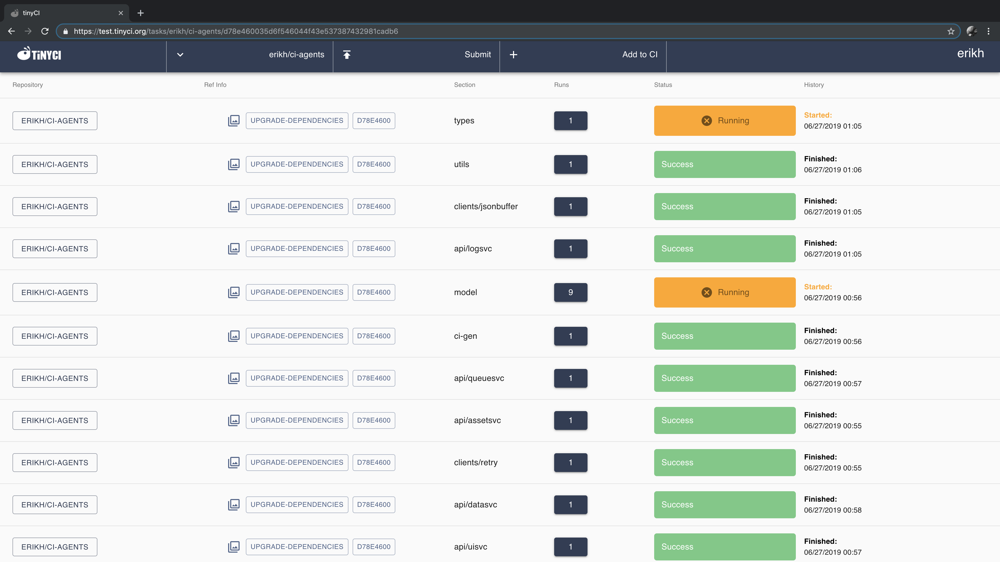
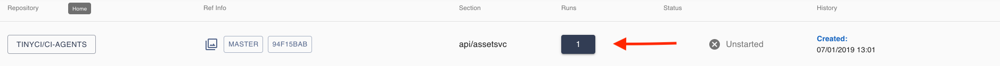
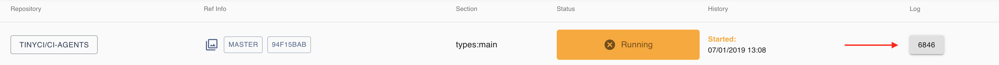
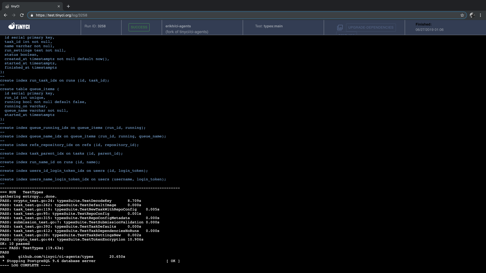

TinyCI has two official clients: the React UI and `tinycli`. UIs need to be
able to react the `uisvc` to interact with tinyCI.

## React UI

The React UI is a web interface written in the react javascript toolkit. It
uses the same functions and calls that the other components do to reap its
data.

Unlike tinycli, the react UI exposes functionality based on
[capabilities](capabilities).

<h6>(Please note all image links open in a new window)</h6>

<a href="../img/screenshots/ui1.png" target="_blank"></a>

### Adding a repository to CI

See [Repository Configuration](repository_config) for more information.

### Submitting a repository

If you have the `submit` [capability](capabilities), you can click the "submit"
button at the top to get a dialog to submit your repository (or fork) and
branch (or SHA). Clicking the "Test All" button will override diff selection
for this run.

### Filtering the list

You can click the "All repositories" drop down to select individual
repositories that have been added to the CI system. Clicking on these names
will filter the task list or run list based on that repository's runs alone. If
you "subscribe" to a repository, you will see them in the list of selectable
repos.

In the future the subscription will be used to display an amalgamated list of
all repositories that have been subscribed to. This feature is currently
unfinished.

### Getting runs for your tasks, and logs for your runs

To get the list of runs for each task, click the numbered button under the "Runs" column.

<a href="../img/screenshots/task_item.png" target="_blank"></a>

This will display a similar looking list for each run in the task's group of runs.

<a href="../img/screenshots/run_item.png" target="_blank"></a>

From there, you can proceed to click on the "Log" item to get at the CI's log
of the test run.

<a href="../img/screenshots/ui2.png" target="_blank"></a>

The log is an xterm emulator so animations and colors will display prominently.
If you need a plaintext description of the log, use `tinycli` for now to get
that log, future support for this is coming.

## tinycli

`tinycli` is a command-line client that works anywhere
[golang](https://golang.org) does.

The rest of this section covers the bootstrap and usage of the tinycli tool.

### Getting a release

Releases can be found on the [ci-agents releases page](https://github.com/tinyci/ci-agents/releases). Download the correct
version for your platform, and enjoy.

### Generating a client token

To work with `tinycli`, you need to generate and store your `uisvc` token. To
do this you use the `init` subcommand:

```text
$ tinycli init
```

### Using tinycli subcommands

tinycli uses a familiar git-like subcommand interface; to see what subcommands
are available, type `tinycli --help`. To see the help for a specific command,
type `tinycli help <subcommand>`.

```text
$ tinycli --help
NAME:
   tinycli - tinyCI CLI

USAGE:
   tinycli [global options] command [command options] [arguments...]

VERSION:
   1.0.0 (tinyCI version 0.1.0)

DESCRIPTION:
   Commandline client to control tinyCI

COMMANDS:
     init, i    Initialize the client with a token and endpoint URL
     submit, s  Submit a job to tinyCI
     runs, r    List runs
     log, l     Show a log by Run ID
     help, h    Shows a list of commands or help for one command

GLOBAL OPTIONS:
   --help, -h     show help
   --version, -v  print the version
```

```text
$ tinycli help submit
NAME:
   tinycli submit - Submit a job to tinyCI

USAGE:
   tinycli submit [command options] [parent or fork repository] [sha]

DESCRIPTION:
   Submit a job to tinyCI

OPTIONS:
   --all, -a  For a test of all task dirs, not just diff-affected ones
```
